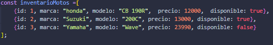
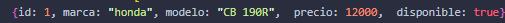

## Analisis
- Entrada: * Un arreglo de objetos (Array de Objects) donde cada objeto representa una moto con las propiedades: id, marca, modelo, precio y disponible (booleano).

- Proceso:
Recorrer el inventario de motos.

Verificar mediante condicionales si cada moto cumple con los requisitos: pertenecer a la marca buscada, no superar el presupuesto máximo y estar disponible para la venta.

- Salida: Un nuevo arreglo con las motos que pasaron todos los filtros. Si ninguna cumple, devuelve un arreglo vacío.

## Reglas identificadas
Pruebas
Caso normal
Entrada:

Resultado esperado:

Caso borde
Entrada:
Inventario: El mismo del caso normal.

Filtros: Marca: "ACES", Presupuesto Máximo: 10000 (Marca inexistente en el inventario).

Resultado esperado:
[]

